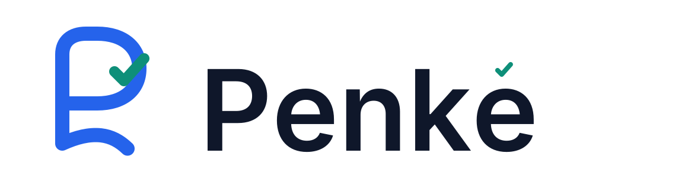

<p align="center">
  
</p>

<p align="center"><strong>Tu firma digital, auténtica.</strong></p>

<p align="center">
  <a href="../../actions/workflows/ci.yml"></a>
  
  
</p>

---

Penké es una aplicación de escritorio para firmar, verificar y validar documentos PDF con certificados digitales acreditados en Ecuador. Descarga e instala — no requiere ningún software adicional.

> El nombre *Penké* se inspira en una expresión de la lengua Shuar asociada con lo auténtico y verdadero.

---

## Características

- **Onboarding guiado** — configuración paso a paso para cualquier usuario
- **Visor PDF integrado** — revisa el documento y elige dónde va tu firma
- **Soporte Token USB** — firma con tu dispositivo HSM físico
- **Firma en lote** — firma múltiples PDFs de una sola vez
- **Perfiles guardados** — reutiliza tu configuración en cada sesión
- **Contraseña recordada** — no vuelvas a ingresar tu clave cada vez
- **Localización inteligente** — autocomplete con todas las provincias, cantones y parroquias del Ecuador
- **Carpeta de destino** — elige dónde se guardan tus documentos firmados

## Descarga

> Próximamente — releases en la sección [Releases](../../releases)

## Desarrollo

```bash
# Instalar dependencias
npm install

# Modo desarrollo
npm run tauri dev

# Build de producción
npm run tauri build
```

### Requisitos para compilar
- Node.js 18+
- Rust (toolchain estable)
- Java 17+ (solo para recompilar el backend; el JAR ya está incluido)

### Regenerar iconos de aplicación

```bash
npx tauri icon brand/master/penke-app-icon.png
```

## Arquitectura

```
Penké EC
├── Frontend: React 19 + TypeScript + Tailwind CSS v4
├── Desktop:  Tauri 2 (Rust) — ventana nativa, sistema de archivos
└── Backend:  Java 17 + Javalin — arranca automáticamente al abrir la app
              └── Usa la librería FirmaDigital (GPL v3) distribuida por MINTEL
                  para el proceso criptográfico de firma
```

El backend Java se inicia y se cierra junto con la aplicación. El usuario no necesita instalar Java ni ningún software adicional.

| Capa | Tecnología |
|---|---|
| Escritorio | Tauri 2 (Rust) |
| Frontend | React 19 + TypeScript |
| Estilos | Tailwind CSS v4 |
| Animaciones | Framer Motion |
| Visor PDF | pdfjs-dist |
| Backend | Java 17 + Javalin |
| Criptografía | FirmaDigital GPL v3 |

## Recursos de marca

Los assets maestros de identidad están en [`brand/master/`](./brand/master/):

| Archivo | Uso |
|---|---|
| `penke-isotipo.svg` | Símbolo solo — iconos, avatares, indicadores |
| `penke-logotipo.svg` | Nombre tipográfico — encabezados, documentos |
| `penke-imagotipo.svg` | Símbolo + nombre — uso principal |
| `penke-imagotipo-descriptor.svg` | Imagotipo + descriptor "Firma digital para Ecuador" |
| `penke-app-icon.svg/png` | Fuente maestra del icono de escritorio |

## Aviso Legal / Legal Notice

Este proyecto es software independiente y **NO es un producto oficial** del Ministerio de Telecomunicaciones y de la Sociedad de la Información (MINTEL) del Ecuador, ni está afiliado, respaldado ni autorizado por MINTEL.

"FirmaEC" y los logos asociados son marcas del MINTEL Ecuador.

Este proyecto utiliza la librería **FirmaDigital**, distribuida por MINTEL bajo licencia **GNU GPL v3**, para realizar el proceso criptográfico de firma. De conformidad con la GPL v3, el código fuente de esta aplicación se distribuye bajo los mismos términos. La librería FirmaDigital está disponible en: [minka.gob.ec/mintel](https://minka.gob.ec/mintel/ge/firmaec/firmadigital-libreria)

Penké utiliza certificados digitales y componentes criptográficos compatibles con el ecosistema ecuatoriano. La validez de cada firma depende del certificado, su vigencia, la integridad del documento y la normativa aplicable.

**Este software se proporciona "tal cual" sin garantía de ningún tipo. El uso es responsabilidad exclusiva del usuario.**

## Licencia

MIT © 2025 Charlie Cárdenas Toledo

> Nota: por el uso de FirmaDigital (GPL v3), si redistribuyes versiones modificadas de este software, debes hacerlo también bajo GPL v3.
